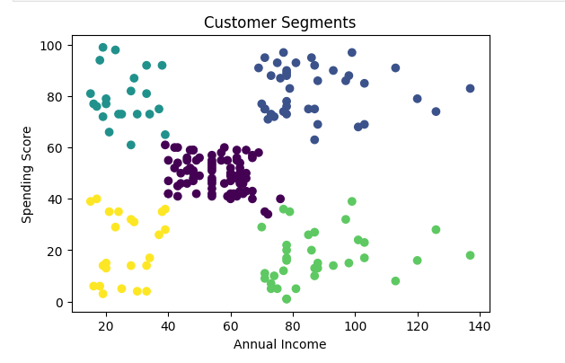

# Customer Segmentation using K-Means

## Objective
Segment customers based on income and spending behavior.

## Tools Used
- Python
- Pandas
- Matplotlib
- Scikit-learn

## Process
1. Data Loading
2. Data Cleaning
3. Exploratory Data Analysis
4. K-Means Clustering
5. Business Insights

## Dataset
The dataset contains customer information including age, gender, annual income, and spending score.

## Model Used
K-Means clustering algorithm was used to segment customers into different groups.

## Results
Customers were segmented into 5 clusters based on income and spending behavior.

## Output Visualization

## Business Value
This segmentation helps businesses:
- Identify high-value customers
- Target marketing campaigns
- Improve customer engagement

## Key Insights
- Identified premium customers
- Found potential customers for marketing
- Segmented customers into 5 groups

## Conclusion
Customer segmentation helps improve business decisions and marketing strategies.
